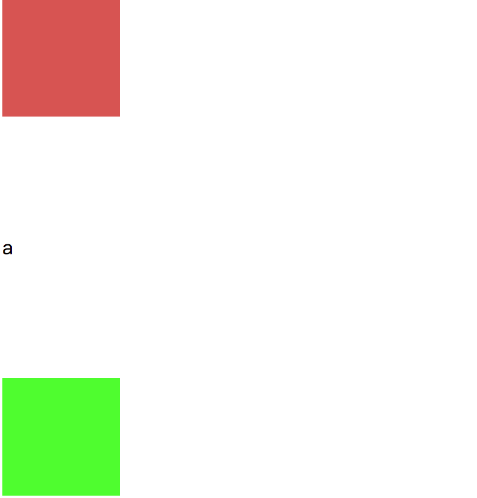

## CSS样式：外边距重叠及父子外边距重叠问题


### 上下外边距重叠

如图:


给`红色`和`绿色`两个BOX分别设置上外边距和下外边距

```
.box1{
	margin-bottom:100px;
}

.box2{
	margin-top:50px;
}
```

结果如图:


此时发现：两个box之间的实际距离是`100px`。
原因:`浏览器在渲染相邻两个box时，如果`**`垂直`**`方向且`**`相邻的`**`box直接各设置了上和外边距，则浏览器只会取`**`最大`**`的那个外边距设置值。而从浏览器的调试工具中可以看到，实际较小的那个外边距也有设置上，只是两边的外边距发生了重叠。`

**`解决办法: 重点看关键字: 垂直、相邻。`**

- 办法1 
	- 我们可以让两个box不相邻，例如在box之间加上一些别的什么元素，例如:字母、一个空标签等。

	

- 方法2 (较好的)
	- 两边取其1，只设置一边的外边距。

### 父子外边距重叠问题

如图:


此时需求: 想将绿色的子box像下移动100px距离，也就是如下图的标识效果:

 
 
 `我们要将绿色的box移动至蓝色局域位置。`
 
 此时我们可以采用外边距的形式，于是我们代码:
 
 ```css
 /*		box2为内部的那个绿色box	*/
 .box2{
 	margin-top:100px
 }

 ```
 
 结果:
 
 
 
 `发现外边距跑出了父容器，且把父容器给向上顶了100px`
 
 这并非我们想要的结果。
 
 - 办法1 
 	- **`重点关键字: 重叠且上下外边距`** 此时刚好是重叠的上下外边距。所以浏览器按理说会取最大的那个外边距，也就是内部容器的那个外边距。于是问题来了，为什么内容器的外边距会跑到外头去呢？ 经过检验，结论: `当父子容器的外边距重叠时，此时设置了自容器的外边距，则该外边距会应用到父容器上。则效果就会出现如上图的结果。`
 	解决版本就是`阻止容器间的重叠`，在容器间添加一个东东，例如`字符，空字符等`。因方式与上面的方法1方式相同，此处不出示例图。
 - 方法2 
 	- 通过父容器的内边距或外边距阻止边框重叠的问题来解决外边距传导的情况,例如: `给父容器增加一个1px的内边距，增加一个1px的边框等`
 	


 	


**`注意: 因为设置padding会影响容器的大小，所以需要记得给相应方向的宽高减去对应内边距的值。`**

- 终极办法
 - 因为padding的设置会影响到内部容器的位置，所以我们可以直接设置父容器相应方向的内边距来把内部容器推至相应位置:
 
 
 
  
 
 **`注意: 刚刚提到的设置padding时的注意事项`**
 	
	
